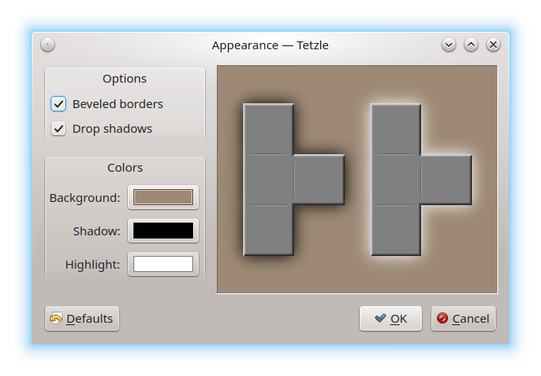

.. _configuration:

Game Configuration
******************

To configure :program:`Tetzle`, open the :guilabel:`Settings` menu. You see the
following entries:

-----------------------------------
:menuselection:`&Appearance` window
-----------------------------------

Opens the :guilabel:`Appearance` window. You can choose between some options
for the appearance of the pieces. In the right half of the window you see a
preview of what you get.

In the left half of the window, you can change the following:

* :guilabel:`Beveled borders` – Highlights the borders of the puzzle pieces, as
  if they were illuminated by light.

* :guilabel:`Drop shadows` – Draws drop shadows around the puzzle pieces.

* :guilabel:`Colors` – You can change the colors for :guilabel:`Background`,
  :guilabel:`Shadow` and :guilabel:`Highlight`. Click on one of the colored
  fields to open a color chooser dialog.

If you like to set back the settings to the initial state, click on
:guilabel:`Defaults`. After you have made your changes, click on :guilabel:`OK`
to apply them, or on :guilabel:`Cancel` to dismiss them and close the
:guilabel:`Appearance` window.

---------------------------------
:menuselection:`&Language` window
---------------------------------

Under :guilabel:`Application Language`, you can change the language of the user
interface. The settings window opens with the button
:guilabel:`<System language>`. Click on it to change the desired language from
the drop-down menu. Again, your changes will be applied after the next start of
:program:`Tetzle`.

.. note::
     Maybe the following command is known to you for opening an application
     with different language settings:

     .. code-block::

        export LC_ALL=C && tetzle

     This doesn't work correctly in :program:`Tetzle`. To change the user
     interface language, we recommend to use the configuration option described
     above. However, not all of the translations come from :program:`Tetzle`
     itself. Some of them come from the underlying Qt libraries, so it might
     happen that button captions etc. still appear in the system language after
     you have changed the language in :program:`Tetzle`.
