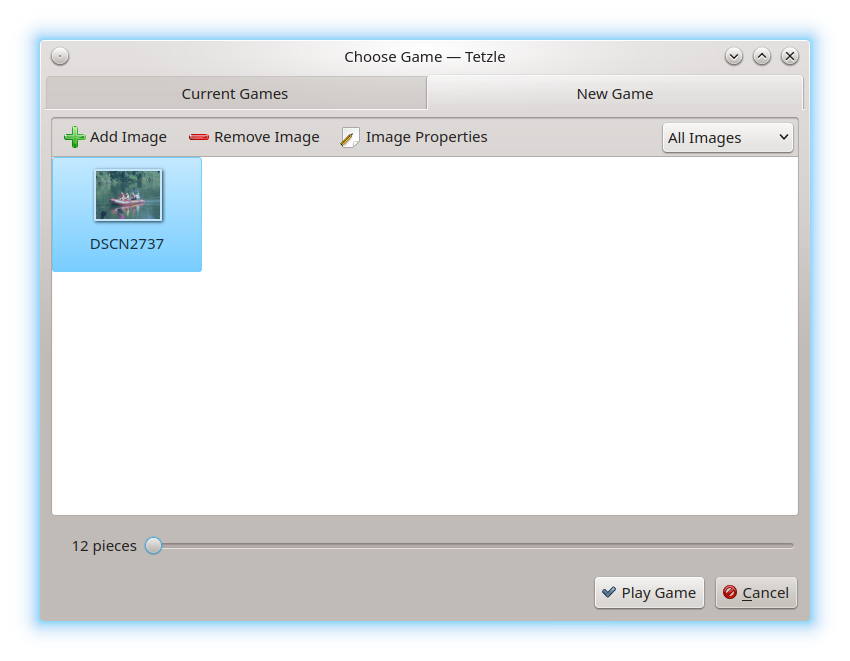
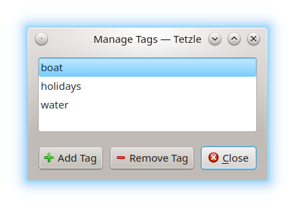
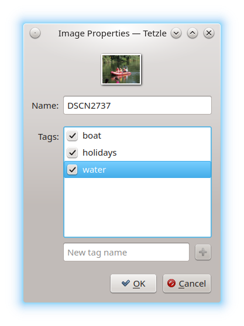
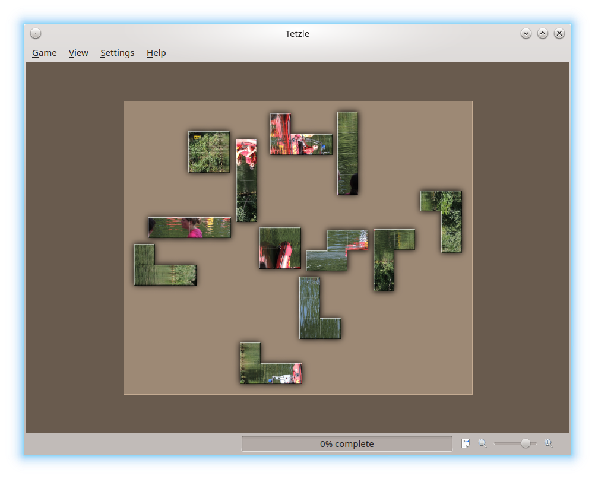
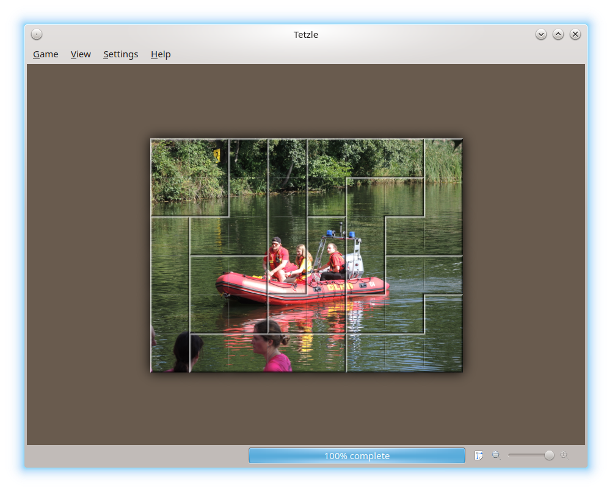

.. _howtoplay:

How to Play
***********

---------------
General Control
---------------

.. Regarding the localizabilty, sentences in table cells should *not* be
   wrapped. Keep always one sentence in a row, otherwise we get multiple
   gettext messages for one sentence. Please review the keyboard controls.

+----------------+--------------------------------------+-------------------------------------+
| Action         | Using the mouse                      | Using the keyboard                  |
+================+======================================+=====================================+
| Pick Up Pieces | Left click.                          | Press the space bar.                |
+----------------+--------------------------------------+-------------------------------------+
| Drop Pieces    | Left click again.                    | Press the space bar again.          |
+----------------+--------------------------------------+-------------------------------------+
| Select Pieces  | Left drag.                           | Left drag.                          |
+----------------+--------------------------------------+-------------------------------------+
| Rotate Pieces  | Right click.                         | Press :kbd:`R`.                     |
+----------------+--------------------------------------+-------------------------------------+
| Drag Puzzle    | Middle Click, or Shift + Left click. | Use the arrow keys.                 |
+----------------+--------------------------------------+-------------------------------------+
| Zoom Puzzle    | Use the scrollwheel to zoom in/out.  | Use the :kbd:`+` or :kbd:`-*` keys. |
+----------------+--------------------------------------+-------------------------------------+
| Move Cursor    | Move the mouse.                      | Use the :kbd:`W, A, D, S` keys.     |
+----------------+--------------------------------------+-------------------------------------+

.. _start_new_game:

----------------
Start a New Game
----------------

.. Please replace TBD with a brief description of supported image file formats

After opening :program:`Tetzle`, the :guilabel:`Choose Game` window appears. If
you already have played :program:`Tetzle`, the :guilabel:`Current Games` tab is
active, and the used pictures appear in an overview, where you can choose one.
Otherwise, click on the :guilabel:`New Game` tab. Then click on
:guilabel:`Add Image` to open a file chooser dialog, where you can open an
image file. You can choose all file formats supported by TBD.

The opened file will be added to the collection. Later you can remove it from
the collection by clicking on :guilabel:`Remove Image`. But keep in mind, if
a game is active and running with this picture, you can't remove it.

To view and change some image properties, click on
:guilabel:`Image Properties`. You can change the name of the picture (which
actually doesn't change the file name itself) and add tags. First you need to
define some tags to apply. Open the :guilabel:`All Images` drop-down menu and
click on :guilabel:`Manage Tags…`.

In the new window, click on :guilabel:`Add Tag` to write something which you
like to use. Repeat this as often as you like and click on :guilabel:`Close`
(the defined tags will be saved automatically). Now you can click on
:guilabel:`Image Properties` to tag the picture.

.. tip::
  The :guilabel:`Add Image`, :guilabel:`Remove Image`, and
  :guilabel:`Image Properties` actions from the toolbar are also available by
  right-clicking on an image file and choose the desired action from the
  context menu.

Use the slider at the bottom of the window to choose of how many pieces the
puzzle should consist. For beginners, the default setting (12) is a good
choice; power users may screw up the value until 972. But keep in mind: The
more pieces you select, the larger the screen need to be to distinguish the
pieces from each other.

Once you are finished, click on :guilabel:`Play Game` to start the game.

---------
Game Play
---------

Now you can move the pieces as described above, using the mouse or keyboard.
When a piece comes into close proximity with a matching piece, the two attract
each other *magnetically*. You can then move and rotate multiple pieces
together. While you are playing, the progress bar at the bottom of the window
shows the percentage of how far you have progressed in completing the image.
Using :menuselection:`&Game --> &Retrieve Pieces` you can rearrange the pieces
in between (which also affects pieces that had disappeared from view due to
zooming and are now visible again).

After finishing the game, you can *repeat* it using
:menuselection:`&Game --> &Choose`. The game chooser dialog shows the current
game with a different arrangement of the pieces. Otherwise, follow the steps
described above to add a new picture and open a new game.

Last but not least, :guilabel:`&Quit` exits from :program:`Tetzle`. If a game
is still open, it will be saved automatically and can be reopened next time you
start :program:`Tetzle`.
